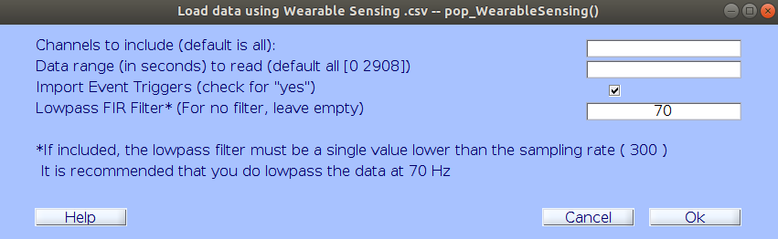

# Fast Friends 

## Preprocessing Example

This section details how to conduct initial pre-processing of an EEG scan using sample data from 2 subjects.

> Details about the Data: Purpose: this folder is used to deposit raw .csv data files following data collection, as well as cleaned data following preprocessing. Raw data files, intermediary files, and final preprocessing-complete files are large in nature and will not fit in Dropbox, so they are stored here. 
> Most of these folders are here for archival purposes. Once data collection resumes, "raw_data" will be used to store .csv files,  "processed_data" will serve as a reserve for intermediary files from preprocessing (.mat and .set/.fdt), and "cleaned_data" will store final, preprocessing-complete .mat files. Currently only "raw_data" exists because we have not cleaned any new data under the updated preprocessing pipeline. 
> This folder does not contain code for preprocessing or data analysis. Code can be found on Dropbox. 

### Setup
1. Download the EEGLAB with a the WearableSensing plugin for MatLab from this link.
2. Open Matlab and the path to the EEGLAB folder. I.E. `addpath('/home/naterose/Desktop/Research/Berkeley/Fast-Friends/eeglab2019_1')`
3. In the File options of EEGLAB, import the first scan `FF_pilot_1.csv` from the raw data folder in `/FastFriends/raw_data/FF_pilot_1.csv`
4. Keep the default settings to import the raw data.

5. Now in the EEGLab options, plot the data by channel. 

## Pre-ICA visual pass

Goals: remove junk data that lead to messy ICA

- Identify and remove bad epochs
- Identify and interpolate bad channels 

Reefer to the Fast Friends documentation

- Filter

1. Remove DC Offset

2. High Pass Filter the Data

3. Not filter on the data: For Noise

4. Pre-ICA cleaning: reject junk data to facilitate ICA

5. ICA 

6. Post-ICA cleaning: square away stray bad epochs

7. Reject Bad Channels

# Mains_Frequency_(Hz) =,60,,,,,,,,,,,,,,,,,,,,,,,,,,,
# Sample_Frequency_(Hz) =,300,,,,,,,,,,,,,,,,,,,,,,,,,,,
# Filter_Delay_(ms) =,43.3,,,,,,,,,,,,,,,,,,,,,,,,,,,
# Sensor_Data_Units =,uV,,,,,,,,,,,,,,,,,,,,,,,,,,,
# Headset_Name =,DSI-24 SN:4559,,,,,,,,,,,,,,,,,,,,,,,,,,,
# Data_Logger =,DSI-Streamer-v.1.08.43,,,,,,,,,,,,,,,,,,,,,,,,,,,
# Date =,12/5/2019,,,,,,,,,,,,,,,,,,,,,,,,,,,
# Time =,12:11:12,,,,,,,,,,,,,,,,,,,,,,,,,,,
# Patient_ID =,X F 01-JAN-0000 X,,,,,,,,,,,,,,,,,,,,,,,,,,,
# Record_ID =,Startdate 05-DEC-2019 EEG_XX X X,,,,,,,,,,,,,,,,,,,,,,,,,,,
# Filter =,Non-Filtered,,,,,,,,,,,,,,,,,,,,,,,,,,,
# Comments =,,,,,,,,,,,,,,,,,,,,,,,,,,,,
# Reference location:,Pz,,,,,,,,,,,,,,,,,,,,,,,,,,,
# Trigger Source,Wireless,,,,,,,,,,,,,,,,,,,,,,,,,,,

- raw data not needed
- preprocessEEG is where all the code is stored

- capLpcation _Where all thee eeg channels will be

- Block number goes from 1-3 to specify the different blocks

- externalLoc
-rerefLoc --? earlobe electrode locations

-Trigger values

- Code to not use the broken

- Rereferencing (Cant measure the voltage of a simple locations need to rereference it to another)

- Remove externals

-So removing the earlobe

### Filtering

- Each electrode is its own battery
- DC Offset- Really wide sine wave
- Do a high pass filter

- Take out activites

We care about frequencies as high as 160hz

Keyboard makes the script pause wherever you want it to

red lines are the audio triggers
-1000 - 1000 = 2 seconds